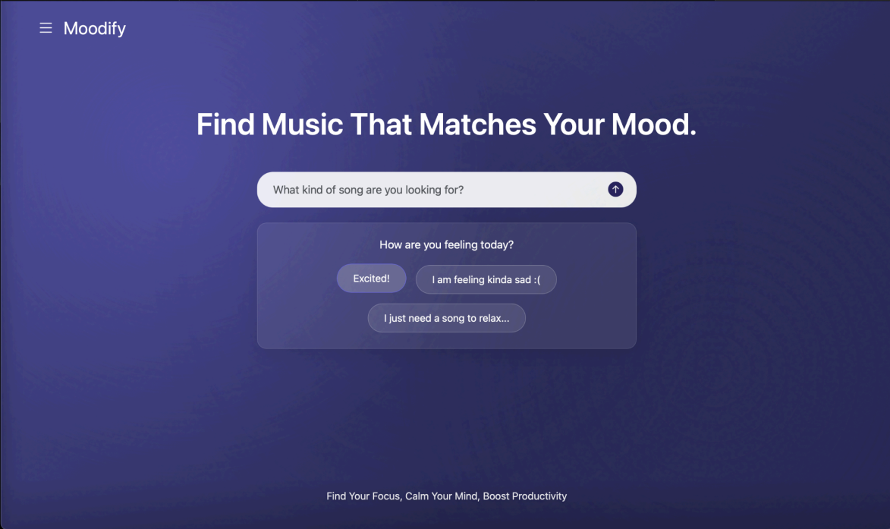
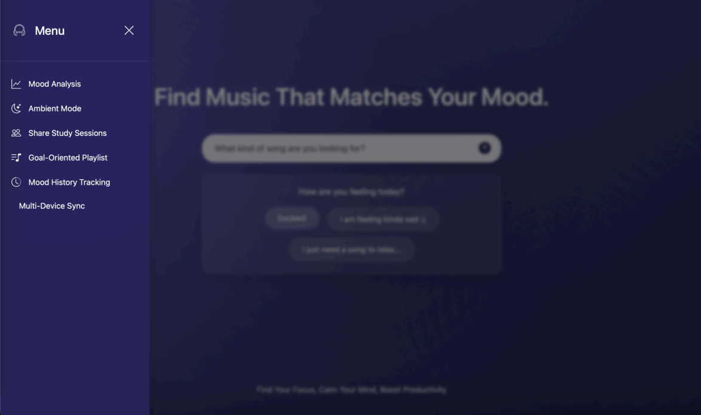
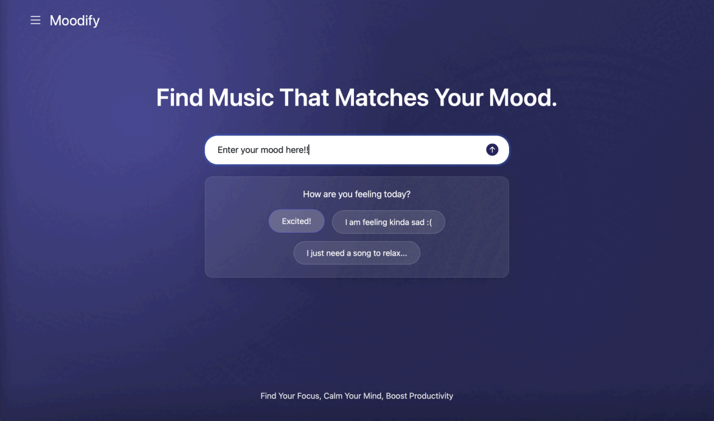
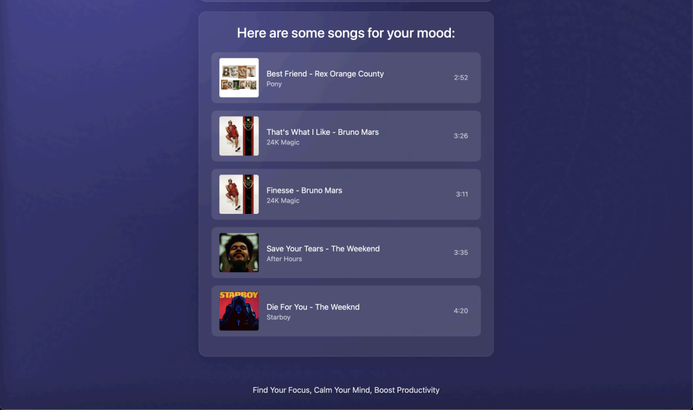

# Moodify AI Application
Moodify is an application that uses Artificial Intelligence (AI) to enhance the user's music experience by recommending songs based on their current mood. 

##Preview
###Home Screen

###Side Menu Bar

###Prompt Box

###Song Lists

###Active Player Screen

##✨ Core Features
- The primary function of Moodify is to connect users with music that perfectly matches their emotional state.
- AI-Powered Mood Analysis: The application uses a developed AI model to analyze the user's current mood.   
- Personalized Song Recommendation: Based on the AI analysis, Moodify recommends a playlist of songs that aligns with the identified mood.   
- Optimal Performance: The AI model and application interface have been optimized and tested to ensure optimal performance and the best user experience.   

